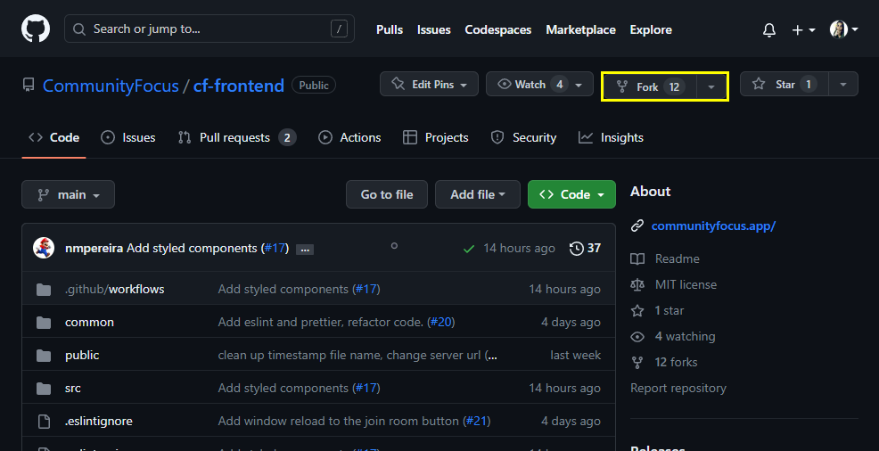
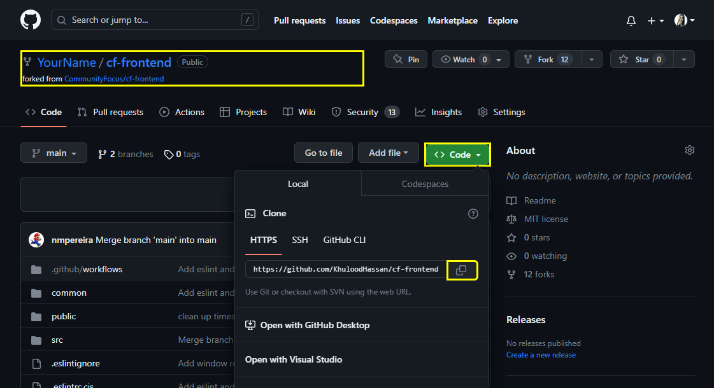
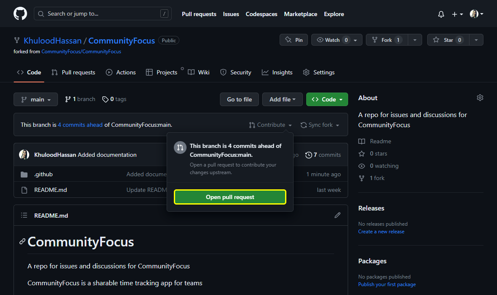

# CommunityFocus Contributing Guide

Want to contribute to Community Focus? Don't know where to start? Don't feel ready to contribute? Read this!

## Table of contents

1. [Prequisites](#prerequisites)
2. [How To Contribute?](#how-to-contribute)
3. [Issues](#issues)
4. [Editing Code](#editing-code)

## Prerequisites

Contributing to Community Focus doesn't require any prerequisites. Few resources that can help you get started with git, React and Typescript are listed below however, you can also reach out to us if you're struggling with anything and we'd be happy to guide you to the rght direction. We expect you to use the resources and try and figure out issues on your own first as this is a learning opportunity.

- [Git Book](https://git-scm.com/book/en/v2)
- [Traversy Media React Crash Course](https://youtu.be/w7ejDZ8SWv8)
- [Traversy Media Typescript Crash Course](https://www.youtube.com/watch?v=BCg4U1FzODs)
- [Scrimba React Course](https://scrimba.com/learn/learnreact)

## How To Contribute

CommunityFocus is built by members of 100Devs but it's open to everyone. If you're a member of 100Devs, join the [Community Focus thread](https://discord.com/channels/735923219315425401/1105270039956951170) on Discord as we hold weekly standups. Send us a message on the thread and we'll assist you in finding issues that match the learning stage you're at right now! Please don't hesistate to ask questions and contribute!

To contribute, we'd like you to start by introducing yourself in the [discussions](https://github.com/orgs/CommunityFocus/discussions/24) conversation.

## Issues

All current open issues can be found [here](https://github.com/CommunityFocus/CommunityFocus/issues). Issues labeled `help wanted` are open issues you can snag and work on.

> Issues marked `good first issue`, as the label suggests, are beginner-level issues that are good for newcomers.

## Editing Code

Community Focus is distributed over 2 repositories; the frontend and the bankend. Follow the guide below to make changes and submit a pull request.

### Repositories
1. Navigate to the [frontend repo](https://github.com/CommunityFocus/cf-frontend)
2. Navigate to the [backend repo](https://github.com/CommunityFocus/cf-backend)

### Forking

1. Navigate to the repositories listed above
2. Locate the `Fork` button on the top right hand side of the webpage just below your username icon
3. Click fork
4. Follow the same steps to fork both repositories

Once forked, you wil have copies of the repositositories, under your profile, to freely modify and make changes to the codebase.

### Cloning

1. Navigate to the forked repositories on your profile page
2. Locate and click the `Code` button above the list of files
3. On the menu pop up, click the clipboard icon and copy the HTTPS URL
4. Open a terminal on your machine and navigate to the directory where you want to clone the repositories
5. Type `git clone <HTTPS-URL>` replacing `<HTTPS-URL>` with the URL copied in step 3.
6. Press Enter
7. Repeat steps 1 through 6 for the second repository

Your project directory should now look like this:
Community Focus/
|-- cf-frontend
`-- cf-backend

### Making Changes

You're now ready to work on your assigned issue! Make changes like you would on any other project. Once you've made the chagnes and tested them thoroughly, you're ready to push changes to your fork!

1. Open a terminal and cd to `cf-frontend`
2. Open a split terminal and cd to `cf-backend`
3. Run `npm run dev` on both terminals to run the app
4. Make your changes
5. Test thoroughly
6. Run `npm run format <path-of-file(s)-you-changed>` - if you changed multiple files, please run this command separately for each file. This command runs prettier and formats the file(s) to Community Focus's configurations
7. Run `npm run lint`
8. Fix ESLint errors if any
9. Commit your changes using `git commit -m "Commit-message"`
10. Push your changes to your fork using `git push`

### Sending a Pull Request

Once you've pushed changes to your main branch, you will need to submit a pull request which is essentially a request for your changes to be merged to the original project.

1. Visit your GitHub profile and navigate to the repo where you made changes; either frontend, backend, or both
2. You will now see a "Compare & Pull Request" prompting you to create a pull request
3. Click on "Compare & Pull Request"
4. Fill the PR template describing the changes you made
5. A reviewer will be assigned to review your changes
6. Your changes will be merged after a reviewer approves your changes

### Syncing your fork on GitHub

Before making changes to your code, make sure to sync your fork. Syncing your fork will pull all the changes from the original project onto your fork. Once synced, run `git pull` on your local files to pull the changes from your remote repository to your local repository

